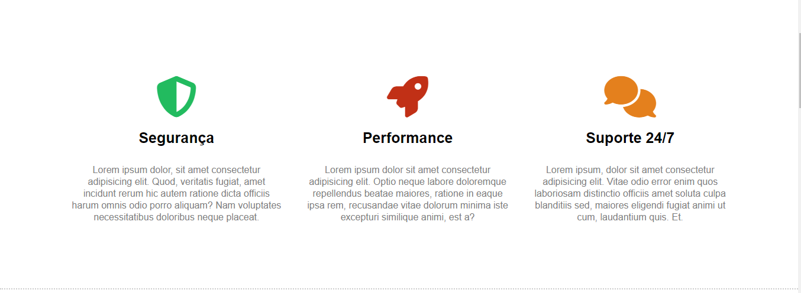
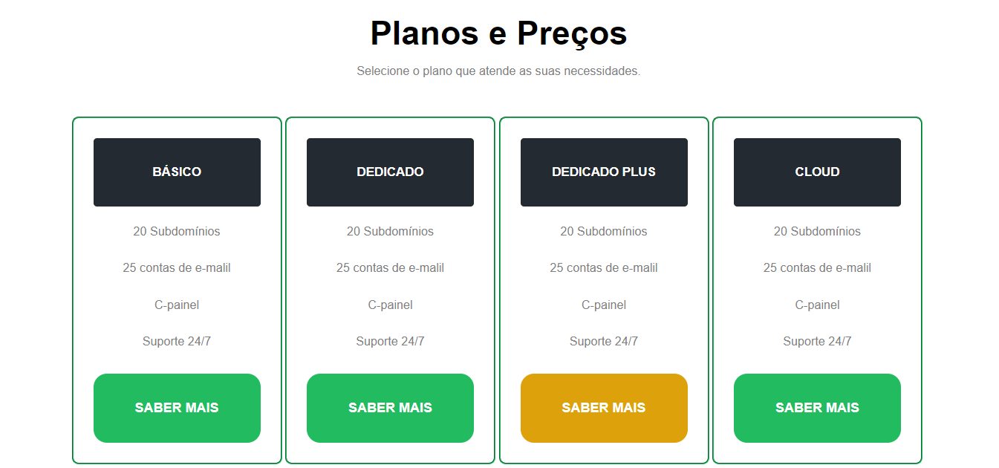

# hDC Host - Serviço de Hospedagem de Sites.

Projeto criado em fevereiro/2024 para praticar conhecimentos em HTML, CSS e Git em conjunto com o curso de Front-End do professor Matheus Battisti.

## Primeira tela:

## Segunda tela:

## Terceira tela:

## Quarta tela:

## Quinta tela:

## Tecnologias usadas no projeto:

 - HTML5
 - CSS3
 - Git
